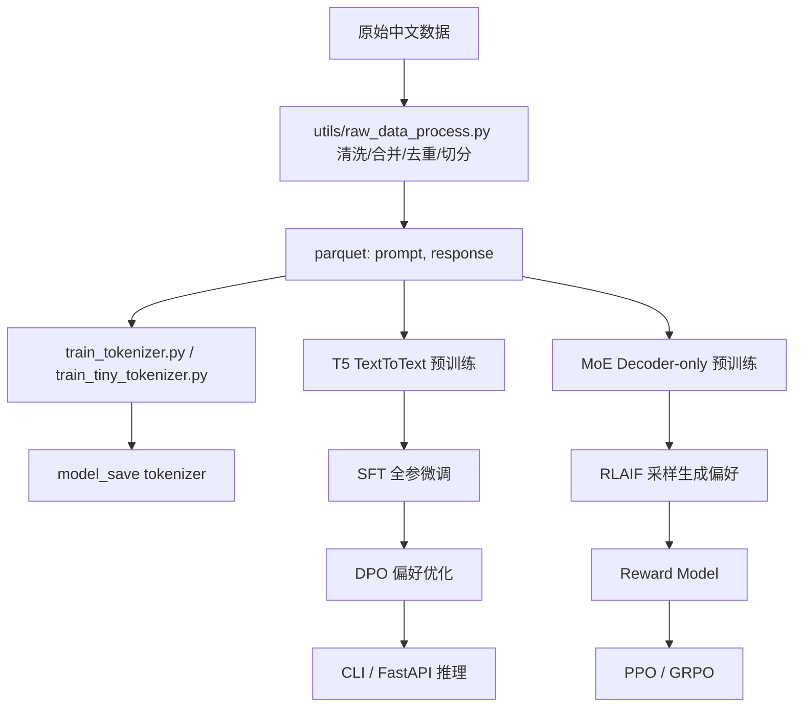

# PalmLLM

PalmLLM 是一个面向学习、实验和单卡受限算力场景的轻量级大模型训练与对齐框架。项目同时覆盖两条路线：

- **PalmLLM 主链路**：基于 HuggingFace/Accelerate 的中文 Text-to-Text 模型训练、SFT、DPO、推理服务，以及一个轻量 MoE Decoder + RLAIF/RLHF 实验链路。
- **pocketLLM 教学链路**：从零手写 GPT 风格 Decoder-only 语言模型，包含预训练、指令微调、分类微调、手写 LoRA、PEFT LoRA 和推理示例。

<div align="center">
  
</div>

## 核心实现

- 从零训练 tokenizer：HuggingFace BPE、SentencePiece BPE、小样本 tiny tokenizer。
- 从零训练模型：T5 风格 Seq2Seq、GPT 风格 Decoder-only、MoE Decoder-only。
- 监督微调：全参 SFT、冻结部分参数微调、指令微调、分类微调。
- 参数高效微调：手写 LoRA、PEFT LoRA、DPO LoRA adapter 训练与合并。
- 对齐训练：DPO、Reward Model、PPO、GRPO、离线启发式 RLAIF 偏好生成。
- 推理部署：CLI 流式对话、FastAPI HTTP 接口、交互式生成与分类推理。
- 数据工程：中文问答/百科/知乎/BELLE/医疗/金融/Wiki 数据清洗、去重、切分、长度统计。

## 项目结构

```text
.
├── config.py                         # PalmLLM 主链路配置：训练、SFT、DPO、推理、T5 模型
├── train.py                          # 自定义 Accelerate 训练入口，fire 暴露 ChatTrainer 方法
├── pre_train.py                      # 基于 Seq2SeqTrainer 的 T5 预训练脚本
├── sft_train.py                      # 基于 Seq2SeqTrainer 的全参 SFT
├── dpo_train.py                      # TRL DPOTrainer，对 SFT 模型做偏好优化，可扩展 LoRA
├── moe_pretrain.py                   # 轻量 MoE Decoder-only 预训练
├── train_tokenizer.py                # 大语料 BPE tokenizer 训练
├── train_tiny_tokenizer.py           # 小样本 parquet tokenizer 训练
├── api_demo.py                       # FastAPI 推理服务
├── cli_demo.py                       # CLI 流式对话
├── accelerate.yaml                   # Deepspeed ZeRO-2 + bf16 的 accelerate 配置
├── model/
│   ├── chat_model.py                 # TextToTextModel，继承 T5ForConditionalGeneration
│   ├── dataset.py                    # parquet 数据集、流式/内存加载、collate_fn
│   ├── trainer.py                    # 自定义训练器：Accelerate、评估、断点、保存
│   ├── infer.py                      # ChatBot 推理封装，支持流式生成
│   └── moe_decoder_lm.py             # 手写 MoE Decoder LM、RMSNorm、SwiGLU、Top-k router
├── rl/
│   ├── rlaif_generate_preferences.py # 用启发式 judge 从模型采样中生成偏好数据
│   ├── reward_model.py               # 基于 MoE LM hidden states 的 Reward Model
│   ├── train_reward_model.py         # pairwise preference loss 训练 RM
│   ├── train_ppo.py                  # 序列级 PPO，对 policy + value head 训练
│   ├── train_grpo.py                 # Group-relative PPO/GRPO 风格训练
│   ├── ppo_policy.py                 # PolicyWithValueHead
│   └── rl_utils.py                   # suffix logprob 工具
├── utils/
│   ├── raw_data_process.py           # 原始数据清洗、合并、去重、切分、统计
│   ├── dpo_data_process.py           # DPO 偏好数据构造与划分
│   ├── functions.py                  # BLEU、MinHash 去重、T5Config 转换、磁盘空间等
│   ├── logger.py                     # 彩色日志与文件日志
│   └── plt_log.py                    # 训练 loss 日志可视化
├── data/                             # PalmLLM 样例数据
├── eval/                             # CMMLU / C-Eval notebook
├── finetune_examples/                # 信息抽取任务数据处理示例
├── model_save/                       # 模型、tokenizer、adapter 输出目录
└── pocketLLM/                        # 从零手写 GPT/LoRA 教学链路
```

## 架构总览

PalmLLM 主链路采用“数据统一为 prompt/response，再按任务转换”的设计：



### 1. Text-to-Text 主模型

`model/chat_model.py` 中的 `TextToTextModel` 继承 `T5ForConditionalGeneration`。项目通过 `config.T5ModelConfig` 定义 T5 关键结构参数，并由 `utils.functions.get_T5_config()` 转换成 HuggingFace `T5Config`。

默认配置规模：

- `d_model=768`
- `d_ff=3072`
- `num_heads=12`
- `num_layers=10`
- `num_decoder_layers=10`
- `d_kv=64`

训练输入统一为：

```json
{"prompt": "用户问题或任务指令", "response": "目标回答"}
```

训练时会为 prompt 和 response 追加 `[EOS]` 或 tokenizer 的 `eos_token_id`，Seq2Seq 任务中 prompt 作为 encoder 输入，response 作为 decoder labels。

### 2. 自定义训练器

`model/trainer.py` 的 `ChatTrainer` 是项目最完整的训练控制器：

- 使用 `Accelerator` 管理单卡/多卡、混合精度、梯度累积。
- 自动根据 CPU 内存和 GPU 数判断数据集是否放入内存。
- 支持中断保存 `accelerator.save_state()`。
- 使用 `Adafactor` 与 `OneCycleLR`。
- 训练中按 `save_steps` 保存最新模型和状态。
- 每个 epoch 用 BLEU-4 在验证集上评估，保存 best checkpoint。

入口：

```bash
python train.py train
python train.py train --is_finetune=True
python train.py train --is_keep_training=True
python train.py test --best_epoch=best
```

多卡/Deepspeed 可使用：

```bash
accelerate launch --config_file accelerate.yaml train.py train
```

### 3. HuggingFace Trainer 路线

- `pre_train.py`：`Seq2SeqTrainer` 预训练。
- `sft_train.py`：加载预训练模型后做全参 SFT。
- `dpo_train.py`：基于 `trl.DPOTrainer` 做偏好优化。

这条路线适合快速实验、复用 HF 保存格式、接入 TensorBoard。

### 4. MoE + RL 对齐路线

`model/moe_decoder_lm.py` 是一个轻量 Decoder-only MoE 语言模型，包含：

- RMSNorm
- Causal Self-Attention，支持 attention chunk 降低显存峰值
- SwiGLU FFN
- Top-k MoE router
- expert capacity 限制
- router 负载均衡辅助损失
- 权重绑定 `tok_emb` 和 `lm_head`

`moe_pretrain.py` 将 parquet 中的 `prompt + response + [EOS]` 拼为 causal LM 样本，训练 next-token prediction。

RL 目录提供从 RLAIF 到策略优化的最小可跑通链路：

1. `rl/rlaif_generate_preferences.py`：对同一 prompt 采样多个回答，用 `HeuristicJudge` 选 chosen/rejected。
2. `rl/train_reward_model.py`：用 pairwise loss `-logsigmoid(score_chosen - score_rejected)` 训练 Reward Model。
3. `rl/train_ppo.py`：用 RM reward 和 KL penalty 做 PPO。
4. `rl/train_grpo.py`：对同一 prompt 生成 group，使用组内相对奖励做 GRPO 风格优化。

这套实现偏轻量实验，方便理解 RLHF/RLAIF 的关键部件，不追求大型工业训练吞吐。

## pocketLLM 子项目

核心模块：

- `model/language_model.py`：GPT 风格 Decoder-only LM，token embedding + position embedding + Transformer blocks + output head。
- `model/attention.py`：手写多头因果自注意力。
- `model/transform_block.py`：Pre-LN Transformer block。
- `model/feed_forward.py`：GELU FFN。
- `model/MoE_FFN.py`：可替换的 MoE FFN 实验实现。
- `utils/dataset_loader.py`：文本预训练、指令微调、spam 分类数据集。
- `utils/model_train.py` / `utils/metrics.py`：训练循环和 loss 计算。
- `utils/model_inference.py`：文本生成与分类推理。
- `utils/lora.py`：纯 PyTorch LoRA 注入、冻结、保存、加载。
- `utils/lora_peft.py`：基于 PEFT 的 LoRA 封装。
- `PocketTorch/core.py`：一个迷你自动微分框架，用于理解反向传播。

### pocketLLM 常用命令

进入子目录后运行：

```bash
cd pocketLLM
```

从零预训练：

```bash
python pretrain.py \
  --config configs/gpt2_config_124M.json \
  --data_path data/pretrain/西游记.txt \
  --model_path model.pth
```

文本生成：

```bash
python generate.py \
  --config configs/gpt2_config_124M.json \
  --model_path model.pth \
  --max_new_tokens 50
```

指令微调：

```bash
python instruction_finetune_train.py \
  --config configs/gpt2_config_355M.json \
  --data_path data/instruction_finetune/instruction-data.json \
  --gpt2_model_path pytorch_model.bin \
  --model_path instruction_executor.pth
```

分类微调：

```bash
python class_finetune_train.py \
  --config configs/gpt2_config_355M.json \
  --data_path data/class_finetune/SMSSpamCollection.csv \
  --gpt2_model_path pytorch_model.bin \
  --model_path review_classifier.pth
```

手写 LoRA 微调：

```bash
python lora_finetune_train.py \
  --task instruction \
  --config configs/gpt2_config_355M.json \
  --data_path data/instruction_finetune/instruction-data.json \
  --gpt2_model_path pytorch_model.bin \
  --adapter_path lora_adapter.pth
```

PEFT LoRA 微调：

```bash
python lora_finetune_train_peft.py \
  --task instruction \
  --data_path data/instruction_finetune/instruction-data.json \
  --model_name_or_path gpt2 \
  --adapter_dir outputs/lora_peft/adapter
```

## 数据说明

### PalmLLM 主链路数据

主训练数据期望为 parquet，至少包含两列：

```text
prompt    string
response  string
```

样例：

```text
data/my_train_dataset_3k.parquet
data/my_valid_dataset_1k.parquet
data/my_test_dataset_2k.parquet
data/rlaif_prompts.jsonl
```

注意：`config.py` 默认指向的是完整数据文件名，例如 `data/my_train_dataset.parquet`、`data/my_valid_dataset.parquet`、`data/my_test_dataset.parquet`。如果只使用仓库内样例，需要把 `TrainConfig` 或脚本中的路径改为 `_3k/_1k/_2k` 样例文件。

### SFT 数据

`sft_train.py` 默认读取 JSON：

```json
[
  {"prompt": "请解释梯度累积", "response": "梯度累积是..."}
]
```

默认路径为：

```text
data/sft_train.json
```

可由 `utils/raw_data_process.py` 中的 `parquet_to_json()` 从 parquet 转换。

### DPO 数据

`dpo_train.py` 需要：

```json
[
  {
    "prompt": "问题或指令",
    "chosen": "更好的回答",
    "rejected": "较差的回答"
  }
]
```

`utils/dpo_data_process.py` 支持从 Alpaca-GPT4、RLHF 数据和模型自生成 rejected 回答中构造 DPO 数据。

### RLAIF 数据

`data/rlaif_prompts.jsonl` 格式：

```jsonl
{"prompt":"用一句话解释什么是梯度累积？"}
{"prompt":"请用要点列出 MoE 的核心思想。"}
```

`rl/rlaif_generate_preferences.py` 会生成：

```jsonl
{"prompt":"...","chosen":"...","rejected":"...","chosen_score":1.0,"rejected_score":-0.5}
```

## 快速开始

### 1. 安装依赖


```bash
pip install torch transformers datasets accelerate deepspeed trl peft safetensors
pip install pandas numpy pyarrow fastparquet sentencepiece tokenizers tiktoken
pip install rich colorlog psutil torch-optimizer nltk datasketch ujson matplotlib opencc-python-reimplemented
pip install fastapi uvicorn pydantic
```

如果只运行 pocketLLM 的从零 GPT 预训练，只需要：

```bash
pip install torch tiktoken pandas
```

如果运行 PEFT LoRA 或 DPO/RL 相关脚本，再安装：

```bash
pip install transformers accelerate peft trl
```

### 2. 训练 tokenizer

小样本 tokenizer：

```bash
python train_tiny_tokenizer.py
```

输出：

```text
model_save/tiny_tokenizer/
```

大语料 tokenizer：

```bash
python train_tokenizer.py
```

默认读取：

```text
data/wiki.simple.txt
```

输出：

```text
model_save/hf_tokenizer/
model_save/hf_tokenizer_slow/
```

### 3. 预训练 Text-to-Text 模型

先确认 `config.TrainConfig` 中：

- `tokenizer_dir`
- `train_file`
- `validation_file`
- `model_file`
- `output_dir`

示例：

```bash
python pre_train.py
```

或使用自定义训练器：

```bash
python train.py train
```

使用 accelerate：

```bash
accelerate launch --config_file accelerate.yaml train.py train
```

### 4. SFT

确认 `config.SFTconfig` 中：

- `finetune_from_ckp_file`
- `tokenizer_dir`
- `sft_train_file`
- `output_dir`

运行：

```bash
python sft_train.py
```

### 5. DPO

确认 `config.DpoConfig` 中：

- `sft_model_file`
- `tokenizer_dir`
- `dpo_train_file`
- `output_dir`

运行全参 DPO：

```bash
python dpo_train.py
```

`dpo_train.py` 中已经保留了 LoRA 配置示例，可以把主函数改为：

```python
train_dpo(dpo_config, peft_config=peft_config)
merge_lora_weight_into_model(dpo_config, peft_config)
```

### 6. MoE + RLAIF/RL

训练 tiny tokenizer 后，可以把 `moe_pretrain.py` 的 `tokenizer_dir` 指向 `model_save/tiny_tokenizer`，再运行：

```bash
python moe_pretrain.py
```

生成 RLAIF 偏好数据：

```bash
python rl/rlaif_generate_preferences.py
```

训练 Reward Model：

```bash
python rl/train_reward_model.py
```

PPO：

```bash
python rl/train_ppo.py
```

GRPO：

```bash
python rl/train_grpo.py
```

## 推理与服务

### CLI 对话

确认 `config.InferConfig.model_dir` 指向模型和 tokenizer 所在目录：

```bash
python cli_demo.py
```

支持：

- 输入 `exit` 退出。
- 输入 `cls` 清屏。
- 默认使用 `ChatBot.stream_chat()` 流式输出。

### FastAPI 服务

```bash
python api_demo.py
```

默认地址：

```text
http://127.0.0.1:8812/api/chat
```

请求示例：

```bash
curl -X POST http://127.0.0.1:8812/api/chat \
  -H "Content-Type: application/json" \
  -d '{"input_txt":"感冒了怎么办？"}'
```

如果在 `InferConfig.api_key` 中配置了 key，请添加：

```text
Authorization: Bearer <api_key>
```

## 配置说明

所有主链路配置集中在 `config.py`：

- `InferConfig`：推理模型路径、生成长度、API host/port/auth。
- `DpoConfig`：DPO 数据、SFT 模型、beta、batch、lr、保存路径。
- `SFTconfig`：SFT 数据、预训练模型、batch、lr、epoch、保存路径。
- `TrainConfig`：自定义训练器的训练数据、tokenizer、模型保存、梯度累积、混合精度等。
- `T5ModelConfig`：T5 模型结构参数。

建议实验时不要直接频繁改默认类，可以在脚本中实例化后覆盖字段：

```python
from config import TrainConfig

cfg = TrainConfig()
cfg.tokenizer_dir = "./model_save/tiny_tokenizer"
cfg.train_file = "./data/my_train_dataset_3k.parquet"
cfg.validation_file = "./data/my_valid_dataset_1k.parquet"
```
